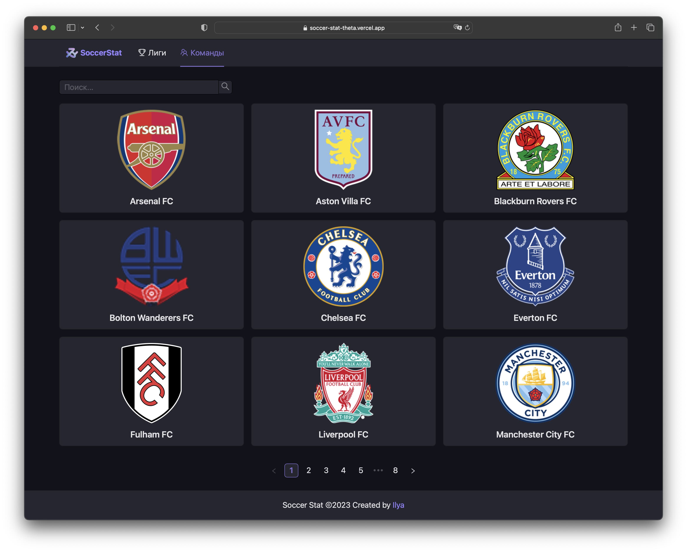
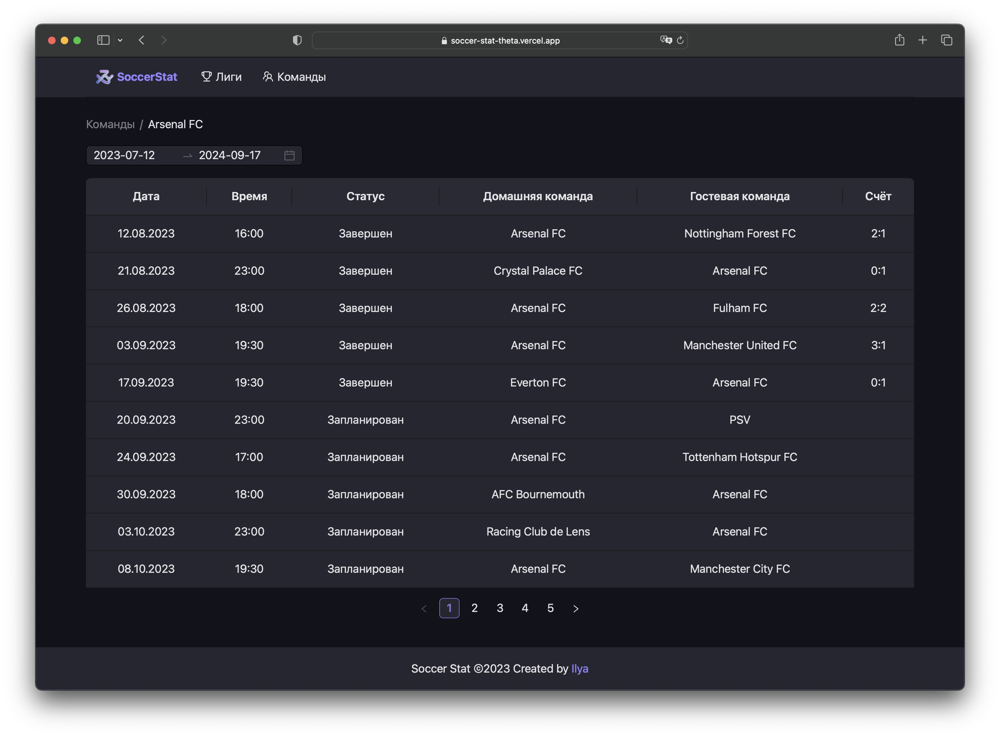
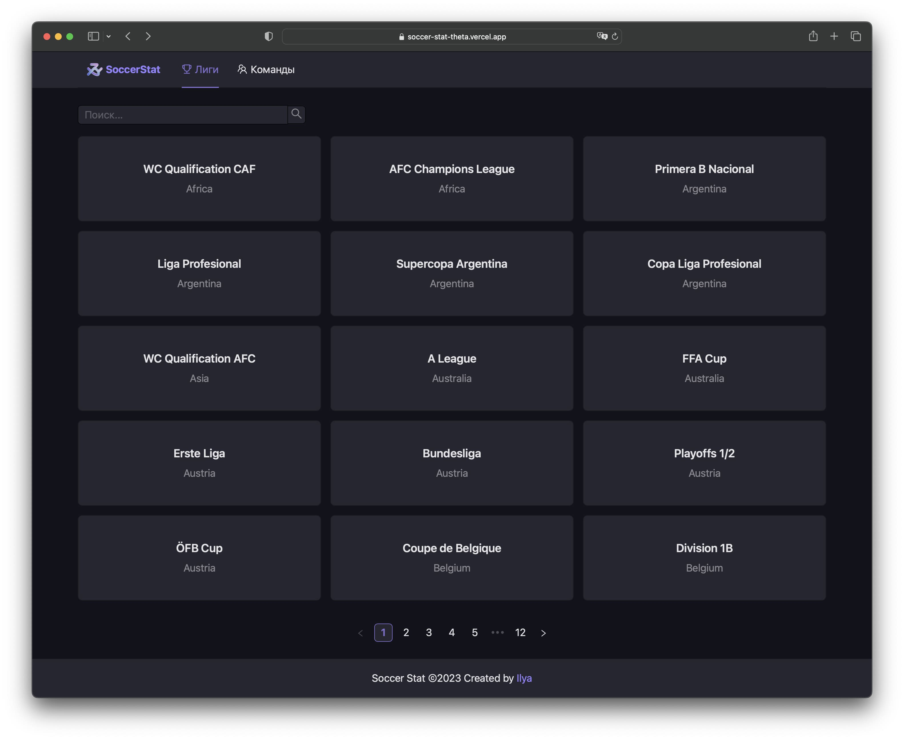
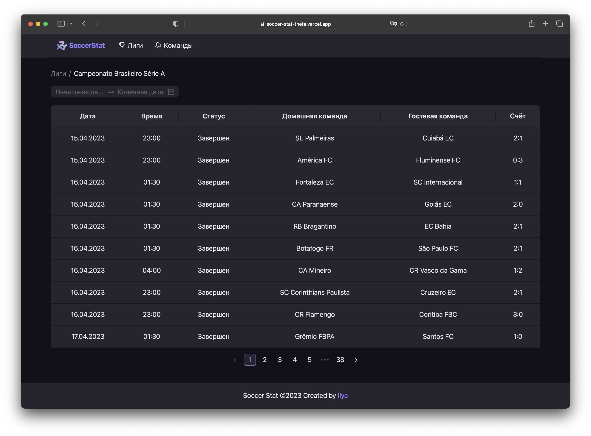

# Soccer Stat

«Soccer Stat» —   is a service for viewing sports statistics, namely football. The application allows you to view the following information: a list of leagues, a list of teams, a list of league matches (league calendar) and a list of team matches (team calendar).

### Technology stack:
- React
- TypeScript
- React Query (TanStack Query)
- Axios
- Ant Design

### API:
As a public API for getting data, it is used https://www.football-data.org/. This API contains restrictions on the free tariff

### Demo:
https://soccer-stat-theta.vercel.app

## Teams:

## Team:

## Leagues:

## League:

